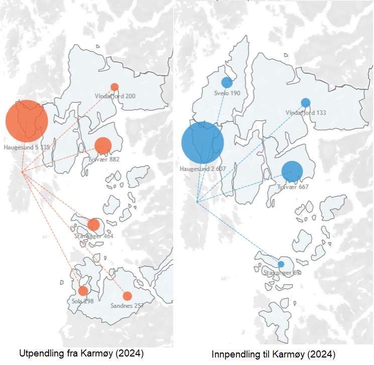

```{r setup, include=FALSE}
knitr::opts_chunk$set(echo = F, message = F,warning = F,error = F, fig.pos = "H")

Sys.setlocale("LC_ALL", "nb-NO.UTF-8")
Sys.setlocale("LC_ALL", "Norwegian Bokmål_Norway.utf8")

library(pacman)
p_load(char = c("here","tidyverse","flextable","crosstable","patchwork","openxlsx","ggrepel"))


shift_axis <- function(p, y=0){
  g <- ggplotGrob(p)
  dummy <- data.frame(y=y)
  ax <- g[["grobs"]][g$layout$name == "axis-b"][[1]]
  p + annotation_custom(grid::grobTree(ax, vp = grid::viewport(y=1, height=sum(ax$height))), 
                        ymax=y, ymin=y) +
    geom_hline(aes(yintercept=y), data = dummy) +
    theme(axis.text.x = element_blank(), 
          axis.ticks.x=element_blank())

}

```

## Befolkning i Karmøy kommune:

### Dagens situasjon av befolkning:

I dag består Karmøys totalt folkemengde 43303 mennesker. Selv om det plasserer Karmøy bland de store kommunene i Norge, er det unik kjennetegn til Karmøys befolkning struktur. Figur 1 nedover illustrerer en av den viktigste karakteristikken; en vidt spredt befolkning. Kartet fra SSB som presentert i figur 1 viser folkemengde densitet per 250 kvadrat meter. Vi ser områder Avaldsnes, Storasund, Vormedal og Norheim i tillegg til de tre byene av Karmøy fungerer som befolkning sentrer i kommunen.

Det er vanlig å dele Karmøy kommune inn i fem administrative områder, som presentert på venstre side av figur 2. En detaljert beskrivelse av befolkningen på Karmøy viser at befolkningen hovedsakelig klynger seg i de administrative områdene 3, 2 og 5, som presentert på høyre side av figur 2. Områdene 3 og 2 omfatter de to største byene på Karmøy, nemlig Kopervik og Åkra, og er posisjonert slik at det er enklere å pendle til viktige industriområder som Gassco og Hydro. Derfor er det ikke overraskende å se at disse to administrative sonene har en større andel av befolkning.

\newpage


\newpage


```{r dagens_befolkning,eval=FALSE}

gk_befolkning<- read.table(file = here("data","forhold data","Befolkning - grunnkrets 2024.txt"),
                        header = T,
                        sep = "\t",
                        encoding = "UTF-8") %>% 
  mutate(region_kode = str_extract_all(string = region, pattern = "[[:digit:]]+",simplify = T)[,1]) %>% 
  mutate(region = trimws(str_remove_all(string = region, pattern = "[[:digit:]]+"))) %>% 
  group_by(region,region_kode,ar,alder) %>% 
  summarise(antall = sum(X04362..Befolkning.))

alder_grupper<- unique(gk_befolkning$alder)


gk_befolkning<- gk_befolkning %>% 
  mutate(ny_aldergruppe = case_match(alder,
                                     c(alder_grupper[1],alder_grupper[2],alder_grupper[7])~"0-19 ar",
                                     c(alder_grupper[3],alder_grupper[4])~"20-29 ar",
                                     c(alder_grupper[5],alder_grupper[6]) ~"30-60 ar",
                                     c(alder_grupper[8],alder_grupper[9],alder_grupper[10],alder_grupper[11]) ~ "60+ ar")) %>% 
  group_by(region,region_kode,ar,ny_aldergruppe) %>% 
  summarise(antall = sum(antall))


admin_unit<- read.xlsx(xlsxFile = here("data","forhold data","admin_unit_recoder.xlsx"),sheet = 1) %>% 
  mutate(admin_sone = paste0("Sone ", admin_sone))

gk_befolkning<- left_join(gk_befolkning,admin_unit,by = c("region_kode" = "grunnkrets_kode"))

poststed_befolkning<-gk_befolkning %>% 
  group_by(admin_sone,ny_aldergruppe) %>% 
  summarise(antall = sum(antall)) %>% 
  group_by(ny_aldergruppe) %>% 
  mutate(alder_antall = sum(antall)) %>% 
  mutate(perc = round(antall/alder_antall,2)*100)
  

totalt_befolkning<- poststed_befolkning %>%
  select(admin_sone,antall) %>%
  group_by(admin_sone) %>%
  summarise(antall = sum(antall)) %>% 
  mutate(perc = round(antall/43303, 2)*100) %>% 
  select(admin_sone,antall,perc) %>% 
  mutate(kategori = "Totalt")

graph_data<- poststed_befolkning %>% 
  select(admin_sone,ny_aldergruppe,antall,perc) %>% 
  rename("kategori" = "ny_aldergruppe") %>% 
  rbind(.,totalt_befolkning) %>% 
  mutate(labels = paste0(antall,"\n","(",perc,"%",")"))

    
graph_data %>%
  ggplot(aes(x = admin_sone, y = kategori))+
  geom_tile(aes(fill = perc),show.legend = F)+
  theme_bw()+
  theme(axis.text.x = element_text(angle = 45,hjust=1))+
  scale_fill_continuous(low = "#fce6a9", high = "#7a0e04")+
  geom_text(aes(label = labels),color = "white")+
  labs(x = "Adminsone", y= "Befolkningsgruppe")

```


### Befolkningvekst, vandring og pendling:

Nå har vi et inntrykk av dagens befolkning i Karmøy, kan vi rette oppmerksomheten mot den historiske endringen og viktige faktorer i befolkningsendring. Først tar vi en kikk på hvordan folkemengde i hvert administrative sone for de siste 24 år. Etterkant kartlegger vi innvandring og innflytting til Karmøy som den viktigste faktorene som bidrar til befolkningvekst i tillegg til generelt befolkningvekst Til slutt analyser vi dagens in-,ut- og innen pendling i Karmøy i denne seksjonen.

Figur 3 beskriver totalt befolkning over de siste 23 år og 3 årlig gjennomsnittlig befolkning endringer etter admin sonene. På den venstre siden av figur 3, ser vi at soner 2,3 og 5 hadde de største antall folkemengde bland de fem sonene mens soner 1 og 4 har hatt en stabil folkemengde i samsvar med de tidligere funnene.

På den venstre siden av figur 3 ser vi at admin sone 1 og 4 hadde en stabil befolkning i løpet av de siste årene.Kanskje den mest nysgjerrige observasjonen om disse to sonene er innenfor tidsperiodene 2000-2003 og 2016-2019. På den høyre siden av figur 3 ser vi at de to soner har tapt folkemengde i disse periodene. Disse observasjoner er noe uventede når vi tar i tanke tidligere studier om pull- og push faktorer for befolkning. Våreide (2024)[^1] viser at de to viktigste faktorene som bestemmer befolkning endringer er sentralitet av område og arbeidsplassvekst. Sentralitetsindeks består av to faktorer igjen[^2]:

[^1]: Vareide, K. (2024). Hvordan skape vekst? Kan steder påvirke sin egen vekst? Regional utvikling, sentralitet og attraktivitet. Cappelen Damm Akademisk. <https://doi.org/10.23865/noasp.173>

[^2]: Høydahl, E. (2020). *Sentralitetsindeksen – SSB*. <https://www.ssb.no/befolkning/folketall/artikler/sentralitetsindeksen>

-   Hvor mange arbeidsplasser kan de som bor i hver enkelt grunnkrets nå med bil i løpet av 90 minutter.

-   Hvor mange servicefunksjoner kan de som bor i hver enkelt grunnkrets nå med bil i løpet av 90 minutter.

Når vi tenker på de to soner (1 og 4), begge to har sin egen industri områder med sterk virksomheten og de er god koblet til servicefunksjoner innen 90 minutter. Så det er rart at vi ser nedgang i folketallet i disse områder.

Sammenlignet med de to har de andre sonene (soner 2,3 og 5) opplevd storre økning i befolkning. Bland de tre soner, sone 5 (fastland side) og sone 3 (Kopervik og sin område) har opplevd det mest økning. Når vi fokuserer på den historisk befolkningendring prosessen som presentert på den høyre siden av figur 3 observerer vi at hver av sone opplevde befolkningsøkning i forskjellige tidsperioder. Sone 5 hadde svært høy befolkningøkning i perioden 2004-2007 og 2012-2015. Sone 3 har opplevd stor økning overalt mellom 2008 og 2015 perioden. Den andre del av denne seks år perioden (2012-2015) sammenfaller med den andre økning perioden til Sone 5. Sammenlignet med de to soner, har sone 2 (Åkra og Vea områder) opplevd sin største økning mellom 2004 - 2011.

```{r befolkningsenter,eval = F}

gk_data<- read.table(file = here("data","forhold data","gk_befolkningsdata_med_admin_kode_utf8.txt"),
                     header = T,
                     sep = "\t",
                     fileEncoding = "UTF-8",
                     encoding = "UTF-8")

as_graphic<- gk_data %>% 
  group_by(ar,admin_sone) %>% 
  summarise(befolkning = sum(befolkning)) %>% 
  arrange(admin_sone,ar) %>% 
  group_by(admin_sone) %>% 
  mutate(roc_perc = (befolkning - lag(befolkning))/lag(befolkning)*100) %>% 
  mutate(roc_count = (befolkning - lag(befolkning)))

admin_sone_graph<-as_graphic %>%
  ggplot(aes(x= ar,y=befolkning,group = as.character(admin_sone)))+
  geom_smooth(aes(linetype = as.character(admin_sone)),se=F,color ="#ed9d13")+
  theme_classic()+
  theme(legend.position = "bottom")+
  guides(linetype = guide_legend(title = "Adm. Soner"))+
  labs(x = "Ar", y = "Befolkning", subtitle = "Befolkningforendring i det siste 23 ar etter admin soner")

annotated_admin_gr<-admin_sone_graph+
  annotate(geom = "text",x = 2023,y = max(as_graphic[as_graphic$ar==2023 & as_graphic$admin_sone==1,]$befolkning)+100,
           label =max(as_graphic[as_graphic$ar==2023 & as_graphic$admin_sone==1,]$befolkning))+
  annotate(geom = "text",x = 2023,y = max(as_graphic[as_graphic$ar==2023 & as_graphic$admin_sone==2,]$befolkning)+100,
           label =max(as_graphic[as_graphic$ar==2023 & as_graphic$admin_sone==2,]$befolkning))+
  annotate(geom = "text",x = 2023,y = max(as_graphic[as_graphic$ar==2023 & as_graphic$admin_sone==3,]$befolkning)+100,
           label =max(as_graphic[as_graphic$ar==2023 & as_graphic$admin_sone==3,]$befolkning))+
  annotate(geom = "text",x = 2023,y = max(as_graphic[as_graphic$ar==2023 & as_graphic$admin_sone==4,]$befolkning)+100,
           label =max(as_graphic[as_graphic$ar==2023 & as_graphic$admin_sone==4,]$befolkning))+
  annotate(geom = "text",x = 2023,y = max(as_graphic[as_graphic$ar==2023 & as_graphic$admin_sone==5,]$befolkning)+100,
           label =max(as_graphic[as_graphic$ar==2023 & as_graphic$admin_sone==5,]$befolkning))


befolknin_ra<- as_graphic %>% 
  arrange(admin_sone,ar) %>% 
  group_by(admin_sone) %>% 
  mutate(subgroup_id = rep(1:6,each = 4)) %>% 
  group_by(subgroup_id) %>% 
  mutate(year_range = paste0(min(ar),"-",max(ar)))


fem_ar_avg <- befolknin_ra %>% 
  drop_na(roc_perc,roc_count) %>% 
  group_by(admin_sone,year_range) %>% 
  summarise(avg_change_perc = round(mean(roc_perc,rm.na=T),2),
            avg_change_count = round(mean(roc_count,rm.na=T))) %>% 
  mutate(labels = paste0(avg_change_count,"\n","(",avg_change_perc,"%",")"))

  
fem_ar_rate_graph<- fem_ar_avg %>%
  mutate(admin_sone = paste0("Sone",admin_sone)) %>% 
  ggplot(aes(x = admin_sone, y = year_range))+
  geom_tile(aes(fill = avg_change_perc),show.legend = F)+
  geom_text(aes(label = labels),color = "white")+
  theme_bw()+
  theme(axis.text.x = element_text(angle = 45,hjust=1))+
  scale_fill_continuous(low = "#fce6a9", high = "#7a0e04")+
  labs(x = "Admin. soner", y = "Ar",subtitle = "3-ar gjennomsnitlige forendringer")


annotated_admin_gr +  fem_ar_rate_graph
```


#### Innvandring, inn-, ut- og internflytting:

I tillegg til naturligvekst, har innvandring og innflytting spilt en betydelig rolle i endringen av befolkningen på Karmøy. Data fra SSB viser, som presentert i Figur 5, at Karmøy historisk sett har vært en kommune hvor folk har flyttet fra. Først etter 2021 ser vi en positiv trend med innflytting fra andre deler av Norge til Karmøy. Sammenlignet med innflytting har Karmøy alltid hatt netto innvandring, men vi ser at det var en nedadgående trend i innvandringen frem til 2018. Selv om innvandringen økte etter 2018, har det vært en ny nedadgående trend i innvandringen etter 2022.

```{r flytting, fig.cap="Nettoinvandring og innflytting til Kommune (_kilde:SSB, tabell 05426 og 05471_)"}
befolkning_flyt<- list.files(path = here("data","forhold data"),pattern = "Befolkningsbevegelse", full.names = T)

innflytting<- read.table(file = befolkning_flyt[1],header = T,sep = "\t",col.names = c("variabel","region","ar","antall"),encoding = "UTF-8") %>%
  select(-region) %>% 
  filter(variabel == "Nettoinnflytting")

innvandring<- read.table(file = befolkning_flyt[2],
               header = T,col.names = c("variabel","region","ar","antall"),
               sep = "\t",encoding = "UTF-8") %>%
  select(-region) %>% 
  filter(variabel == "Nettoinnvandring")

graph_data<- rbind(innflytting,innvandring) %>% 
  mutate(ar = as.character(ar))

inv_plot<-graph_data %>% ggplot(aes(x= ar, y = antall, group = variabel))+
  geom_line(aes(color = variabel),linewidth = 1.2)+
  theme_bw()+
  labs(x = "Ar", y = "Antall")+
  guides(color = guide_legend(title = ""))

shift_axis(p = inv_plot,y = 0)
```

Når vi tar et kikk på innvandrerbefolkningen i Karmøy ser vi en fargerik bilde. I dag det er folk fra rund 105 forskjellige lander som bor i Karmøy. Bland disse landene er de fem største grupper er innvandrerne fra Polen (773), Ukraina (498), Litauen (246), Thailand ( 236) og Romania (203)[^3]. Figur 5 presenterer de tre høyeste flyt av innvandrerne etter år og opprinnelse-land. Karmøy har fått mest innvandrerne fra Polen inntil 2016. Denne trenden har skiftet mellom 2017-2019 og innvandrerne fra Syria har blitt den største gruppen. I 2020 var det en stor nedgang i antall innvandrerne som flytte til Karmøy, mest sannsynlig på grunn av COVID-19 tiltakene. Til slutt vi ser at Karmøy har fått innvandrerne fra Ukraina i følge av krigen.

[^3]: SSB, tabell 09817: Kommune- og fylkestall for innvandrere og norskfødte med innvandrerforeldre, totalt og enkeltvis, etter landbakgrunn og andel av befolkningen (K) 2010 - 2024 (<https://www.ssb.no/statbank/table/09817/>)

```{r innvandrer_bakgrunn, fig.cap="Buna nasil bi baslik yazilacak la_(Kilde:SSB, tabell 09817)_"}

inv<- read.table(file = here("data","forhold data","09817_Innvandrere og norskfodte med innvandrerforeldre.txt"),header = T, sep = "\t",encoding = "UTF-8",fileEncoding = "UTF-8") %>% 
  filter(antall != 0) %>% 
  arrange(landbakgrunn,ar) %>% 
  group_by(landbakgrunn) %>% 
  mutate(roc = antall-lag(antall)) %>% 
  ungroup()

graph_data<- inv %>% 
  drop_na(roc) %>% 
  group_by(ar) %>% 
  slice_max(order_by = roc, n = 3) %>% 
  mutate(ar = as.character(ar)) %>% 
  ungroup()
  
graph_data %>% ggplot(aes(x = ar,y = roc))+
  geom_point(aes(color = landbakgrunn, size = roc),show.legend = F)+
  geom_text_repel(aes(label = landbakgrunn, size = roc),show.legend = F)+
  theme_bw()
 

```

Når det gjelder intern innflytting, ser vi at de fleste flyttet til Karmøy fra Haugesund mellom 2020 og 2024, som presentert i Figur 6 nedenfor. På tvers av alle aldersgrupper kommer omtrent 40% av de som flyttet til Karmøy fra en annen del av Norge, fra Haugesund. Dette følges i stor grad av Vestlandet, mest sannsynlig fra Bergen, på tvers av alle aldersgrupper. Når det gjelder tilstrømning av nye borgere fra andre kommuner på Haugalandet, har Tysvær vært hovedkommunen for dem som flyttet til Karmøy. Det eneste unntaket her er den aller yngste aldersgruppen (0-2 år), hvor en større del ser ut til å ha flyttet til Karmøy fra Oslo i løpet av de siste fire årene.


Mønsteret er ganske likt for de som flyttet fra Karmøy til en annen del av Norge i løpet av de siste fire årene. Figuren 7 nedenfor viser at på tvers av alle aldersgrupper har Haugesund vært det mest populære reisemålet. Vestlandet og andre deler av Rogaland kommer på andre og tredje plass. Dette mønsteret endres bare for aldersgruppene 65+ år og 3-12 år. For den første har Tysvær vært det nest mest populære stedet å flytte til, mens det for den siste gruppen er Rogaland i stedet for Vestlandet. Til slutt har det vært noe utvandring til andre kommuner i Haugalandet-regionen, men størrelsen på dette er ganske ubetydelig på tvers av alle aldersgrupper.

For å få en oversikt på internflytting mønsteret i Karmøy, bruker vi data fra Kompas som gir oss antall person som flyttet innen Karmøy (mellom admin soner) mellom 2013 - 2022. Dessverre er mer nylig data om internflytting ikke tilgjengelig på Kompas eller SSB. Når vi ser på figur 8 nedenfor, ser vi at det ikke er et sterk inter admin sone mønster mellom admin soner selv om det har vært rundt 2308 personer som flyttet innen Karmøy. Det mest åpenbart mønster som vi kan se på figuren nedenfor at det mest vanlig for folk å flytte innen enkelt admin sonen. For eksempel, rund 65 prosent av folket som flyttet fra admin sone 3 har flyttet til en annen sted innen admin sone 3. For de andre admin soner skjer fortsett den største internflytting innen sonen selv om andel til hver sone er litt annerledes.


\begin{landscape}

\begin{figure}[p]
\centering
  
  \includegraphics[width=1.5\textwidth, height = 2.0\textwidth]{./graphs/eksterne_innflyttere.png}
   \caption{Ekstern innfylttere til Karmøy fordelt etter aldersgruppe og flyttesoner \textit{Kilde:SSB/Kompas}}

\end{figure}

\end{landscape}


\newpage
\begin{landscape}

\begin{figure}[p]
\centering
  
  \includegraphics[width=1.5\textwidth, height = 2.0\textwidth]{./graphs/ekstern_utflyttere.png}
   \caption{Ekstern utflyttere fra Karmøy fordelt etter aldersgruppe og flyttesoner \textit{Kilde:SSB/Kompas}}

\end{figure}

\end{landscape}

\newpage


\newpage
\begin{landscape}

\begin{figure}[p]
\centering
  
  \includegraphics[width=1.5\textwidth, height = 2.0\textwidth]{./graphs/internflytting.png}
   \caption{Gjennomsnittlig internflytting mellom admin soner i Karmøy kommune mellom 2013 - 2022 \textit{Kilde: SSB/Kompas}}

\end{figure}

\end{landscape}


Til slutt fokuserer vi på inn- og ut-pendling mønstrene i Karmøy. Venstre panel på Figuren 9 nedenfor viser utpendling fra Karmøy kommune mens høyre panel demonstrerer innpendling til Karmøy i 2024. Pendling er beregnet som antall personer som jobber i et annet stedt enn deres bosted adresse. For å illustrere det med et eksempel betyr statistikken at det er 200 mennesker hvem har sine bostedsadresser i Karmøy på Folkeregister mens sine arbeidssted adresser i Vindafjord. Statistikken viser at disse rund 9000 yrkesaktiv mennesker i Karmøy har sine arbeidsplasser om hele landet, så vi antar at det er ikke mulig å pendle til Oslo eller Hammerfest i nord hverdag. Det er mest sannsynlig at folk pendler hverdag innen Rogaland mens det er mennesker som gjør fjernarbeid[^4]. Derfor forstår vi "pendler" som folk med bostedet i Karmøy men arbeidsstedet innen 90 minutter reiseavstand.

[^4]: Vi kan ikke utelukke muligheten at registerdata har noen grad feil margin. Tabellen fra SSB om pendling er bygget opp ved bruk av folkeregisteret. Derfor det er mulig ar folk har flyttet ut fra Karmøy til deres arbeidssted men har ikke oppdatert sitt bosted.

Tatt sammen, ser vi at det er mer vanlig å pendle ut fra Karmøy enn å pendle inn til Karmøy. Når det gjelder til utpendling, pendler folk ut til Haugeland mest vanlig. Tysvær og Stavanger rekker på den andre og tredje plassene i denne rekkefølgen. Når vi vender vår oppmerksomhet mot innpendling til Karmøy, ser vi et lignende mønster. Karmøy får innpendling mest fra Haugesund, Tysvær, og Stavanger. Forskjellig fra det utpendling mønstre er at det finnes folk som bor i Sveio men jobber i Karmøy.



### Befolkningframskriving

For å forstå dagens fremtidens boligbehov, begynner vi analysen med en oversikt over befolkningen i Karmøy kommune. Basert på framskriving analyse fra SSB. I sin framskrivninganalyses, lager SSB framskrivning modeller som inneholder forsjellige alternativer tvers fire parametere: 1) fruktbarhet, 2) levealder, 3) innenlands flytting og 4) inn- og utvandring. I denne seksjonen tar vi oss Hovedalternativet, lav nasjonal vekst, og høy nasjonal vekst. Hovedalternativet er befolkning framskriving om det er middels frukbarhet, levealder, innenlands flytting og inn- og utvandring. "Middels nivå" er beregnet som gjennomsnitt av hvert indikatorer for de siste fem år før tidsperioden til framskriving, i dette tilfellet det er mellom 2015-2020. Lav nasjonal vekst alternativet omfatter en scenario med lav fruktbarhet, svak aldring, middels nivå innenlands flytting og lav innvandring. På den andre siden omfatter Det høyt nasjonal vekst alternativet høy nivå fruktbarhet, aldring, og innvandring mens middels nivå innenlands flytting. Som alle framskrivnings modeller tapper SSBs modeller nøyaktighet for senere årene i perioder. For å illustrere kan vi se på figur 10 nedenfor. Mens model for hovedalternativet har prognose intervall +- 0.09 million, øker dette intervallet opp til +-0,61 million mennesker. Så det er alltid lurt å holde det på tanke mens vi går gjennom befolkningframskrivning.


Figur 11 nedenfor illustrerer de tre hoved alternative befolkningframskrivningene. Vi ser at på hovedalternativet er det sannsynlig for Karmøy befolkning å holde seg stabilt gjennom neste 26 år. Med svakt nedsettelse fra dagens befolkning av 43303 kan det forventes å gå ned til 43101. Når vi ser på de høye og lave alternativene, observerer at det kan bli sterk økning eller nedgang avhengig av fruktbarhet, innvandring og aldring. I det høyt scenariet kan vi forvente Karmøys befolkning å øke opp til 47145 og i det lavt scenariet kan vi forvente det å sinke ned til 38676. Selv om disse scenariene presenterer svært forskjellige scenarier, er det dessverre umulig å si hvilket er det mest sannsynlig fordi det er ofte sjeldne hendelser som forårsaker disse ekstremene. For eksempel, en høy innvandring kan forårsakes av en krig som Ukrainske krig, eller lav innvandring kan være forårsaket av en økonomisk krise. Så det kunne være smart å tenke disse alternativene som "de beste og verste scenarier".

```{r befolkning_framskriving, fig.cap="Befolkningframskrivinger for Karmøy (_kilde:SSB, tabell 07459 og 13600_)"}

dagens_befolkning<- read.table(file = here("data","forhold data","Befolkning - kommune, alder og kjonn opptil 2024.txt"),header = T,sep = "\t",encoding = "UTF-8")

befolkning_fs<- read.table(file = here("data","forhold data","Befolkning - framskriving opptil 2050.txt"),header = T,sep = "\t",fileEncoding = "UTF-8",encoding = "UTF-8") 

dagens_befolkning_aggregert<- dagens_befolkning %>% 
  group_by(region,ar) %>% 
  summarise(antall = sum(X07459..Befolkning.))

befolkning_fs_aggregert<- befolkning_fs %>% 
  group_by(region,ar,statistikkvariabel) %>% 
  summarise(antall = sum(X14288..Framskrevet.folkemengde.1..januar.))

befolkning_fs_aggregert_dfs<- split(befolkning_fs_aggregert,befolkning_fs_aggregert$statistikkvariabel)

hoyalt<- rbind(dagens_befolkning_aggregert,befolkning_fs_aggregert_dfs[[2]]) 

hoyalt_val<- hoyalt %>% drop_na(statistikkvariabel) %>% pull(statistikkvariabel) %>% unique()

hoyalt<- hoyalt %>% mutate(statistikkvariabel = case_when(is.na(statistikkvariabel)~hoyalt_val,.default = statistikkvariabel))

lavalt<- rbind(dagens_befolkning_aggregert,befolkning_fs_aggregert_dfs[[3]])%>% 
  mutate(statistikkvariabel = case_when(is.na(statistikkvariabel) ~"Lav nasjonal vekst (LLML)",.default = statistikkvariabel))

hovedalt<- rbind(dagens_befolkning_aggregert,befolkning_fs_aggregert_dfs[[1]]) %>% 
  mutate(statistikkvariabel = case_when(is.na(statistikkvariabel)~"Hovedalternativet (MMMM)",.default = statistikkvariabel))

graph_data<- rbind(hovedalt,lavalt,hoyalt)

graph_data %>% 
  ggplot(aes(x= ar,y=antall,group = statistikkvariabel))+
  geom_smooth(aes(color = statistikkvariabel),linewidth = 1.2, se = F)+
  annotate(geom = "text",x = 2050,y = max(lavalt[lavalt$ar==2050,]$antall)-110,label=max(lavalt[lavalt$ar==2050,]$antall))+
  annotate(geom = "text",x = 2050,y = max(hoyalt[hoyalt$ar==2050,]$antall)+200,label=max(hoyalt[hoyalt$ar==2050,]$antall))+
  annotate(geom = "text",x = 2050,y = max(hovedalt[hovedalt$ar==2050,]$antall)+200,label=max(hovedalt[hovedalt$ar==2050,]$antall))+
  theme_classic()+
  theme(legend.position = "bottom")+
  guides(color = guide_legend(title = ""))


```

Når vi ser på fordelingene av befolkningframskrivningene etter alder som presentert i figur 12, observerer vi at det er ingen scenario hvor Karmøy opplever en økning i befolkning som kan bli yrkes aktiv eller ungdom. Sammenlignet med disse gruppene, eldrebefolkning er framskrevet å øke stadig for det neste 25 år.

```{r framskriving_etter_ar,fig.cap= "Befolkning framskriving etter alder"}

befolkning_fs<- read.table(file = here("data","forhold data","Befolkning - framskriving opptil 2050.txt"),header = T,sep = "\t",fileEncoding = "UTF-8",encoding = "UTF-8") %>%
  group_by(alder,ar,statistikkvariabel) %>% 
  summarise(antall = sum(X14288..Framskrevet.folkemengde.1..januar.))

befolkning_fs %>% ggplot(aes(x = ar, y = antall,group = alder))+
  geom_smooth(aes(color = alder),se=F, linewidth = 1.2)+
  theme_classic()+
  theme(axis.text.x = element_text(angle = 45,vjust = .5,hjust = .7),legend.position = "bottom")+
  guides(color = guide_legend(title = "Alder"))+
  facet_wrap(~statistikkvariabel)

```

Slik vi kan oppsummere hovedfunnene av befolkning analyse; 1) befolkning i Karmøy er vidt spredt over hele kommune. 2) Mens det er folk som bor nesten alle delene av Karmøy, fungere admin soner 3 (Kopervik område), Sone 2 (Åkra område) og Sone 5 (fastland område) som populasjon senterer. 3) Spesielt sone 5 og sone 3 tiltrekker mest befolkning økning mens sone 1 og 4 står i fare for å miste befolkning. 4) For det siste ti årene innvandring har vært den primer kilden av befolkning øking i tillegg til naturlig men det ser ut som at de siste et par årene har det avtatt med unntak av asylsøkerne. 5) Innflyttingen, på den andre siden, har økt for de siste to år og tok over innvandring. 6) Et dypere kikk på befolkningbevegelser viser at det skjer ofte innen Haugelandet, hvor Haugesund er hovedmål. 7) Inn og ut pendling mellom Karmøy og resten av Haugelandet er også veldig vanlig. 8) For det siste, framskrivinger viser at befolkning i Karmøy skal bli eldre og eldre uansett av framskrivning scenariet.

Basert på disse åtte resultatene hittil her kan vi gjøre noe slutninger for etterspørsel i boligmarkedet i Karmøy før vi begynner å analyse hvordan folk bor i Karmøy. Først og fremst, det skal bli en økt etterspørsel for boliger i admin soner 2,3 og 5 siden det er allerede etablert befolkning sentere med tilgang til tjenester, arbeidsplasser og veier. Motsatt er etterspørsel for boligene i soner 1 og 4 sannsynlig å synke fordi befolkning analyse viser at de tapper innbygger. Siden gruppen som gir økning til folkemengde i Karmøy er innvandrerne, vil de påvirke etterspørselen etter boligtypen vil være innvandrere, spesielt folk fra Polen, Ukraina og Litauen. Den andre gruppen skal bli eldrefolk hvem som skal bli kanskje den største kunde gruppen i boligmarkedet. De andre kommunene og byene i Haugelandet er mest sannsynlig det sterkeste alternativet, eller konkurrentene, av boligmarkedet i Karmøy siden det er ofte andre kommuner i Haugelandet som folk flytter til fra Karmøy.

### Sammensetning av husholdninger

Nå som vi har fått en oversikt over kjennetegnene til befolkningen på Karmøy, fortsetter vi med sammensetningen av husholdninger (HH), presentert i Figur 13. Mens mange av gruppene er selvforklarende, refererer husholdninger med 2 personer eller flere til de som bor sammen i samme bolig. Denne tabellen fra SSB omfatter bare privathusholdninger, der personer som bor i samme privatbolig regnes som en del av samme husholdning.

Sammensetningen av husholdninger gjenspeiler i stor grad utviklingen av befolkningen. Blant husholdningstypene ser vi en tydelig økning i antall aleneboende og husholdninger med to personer de siste ti årene. Samtidig ser vi en nedadgående trend når det gjelder husholdninger med barn. Kun i husholdninger med ett barn ser vi en liten økning etter 2021. Basert på tidligere resultater, i kombinasjon med husholdningstatistikk, kan vi konkludere med at det vil være flere eldre som bor alene eller sammen med sin samboer i Karmøy kommune.

Når vi ser på eierstatusen til private husholdninger i Karmøy, presentert i Figur 14, ser vi at nesten 90% av husholdningene i kommunen eier boligen de bor i selv. Leie og deleierskap av boliger er relativt sjeldent i Karmøy.

```{r husholdning,fig.cap="Antall husholdninger (HH) etter type i Karmøy (_kilde:SSB, tabell 06081_)"}

karmoy_hh_dtaller<- read.table(file = here("data","forhold data","Husholdning - Personer i privathusholdninger som antall husholdning.txt"),
                               header = T,
                               sep = "\t",
                               fileEncoding = "UTF-8",
                               encoding = "UTF-8",
                               col.names = c("region","hh_type","variabel","ar","antal"),
                               row.names = NULL) %>% 
  mutate(hh_type = str_remove(pattern = " (yngste barn 0-17 ar) ", hh_type)) %>% 
  mutate(hh_type = str_replace(pattern = "Husholdninger|husholdninger",replacement = "HH",hh_type)) %>% 
  mutate(hh_type = str_replace(pattern = " barn eller flere",replacement = "+ barn",hh_type)) %>% 
  mutate(hh_type = str_replace(pattern = " personer eller flere",replacement = "+ personer", hh_type))
  

karmoy_hh_dtaller %>% ggplot(aes(x = ar, y = antal, group = hh_type))+
  geom_line(aes(color = hh_type),linewidth = 1.2)+
  theme_classic()+
  theme(legend.position = "top")+
  scale_x_continuous(breaks = seq(from = min(karmoy_hh_dtaller$ar),to = max(karmoy_hh_dtaller$ar),by =2))+
  guides(color = guide_legend(title = ""))

```

Resultatene fra en nylig forskning om boligønsker og bosituasjon blant eldre på nasjonalt nivå, utført av forskere ved Oslomet universitet, kan hjelpe oss med å kontekstualisere våre resultater[^5]. Forskningsprosjektet viser en tendens blant personer over 60 år til å flytte til leiligheter i blokker (se lysark 31). Når det gjelder boligegenskaper, ser vi at to egenskaper er viktige for den aldrende befolkningen. For det første ønsker de at "*Boligen er slik at man kan leve mest mulig uavhengig av andres hjelp*". For det andre ønsker de at boligen er enkel å vedlikeholde. På naboskapsnivå ser vi at eldre foretrekker å bo i nabolag med godt kollektivtilbud[^6], tilgang til rekreasjonsområder som skog og mark, og nærhet til helsetjenester (se lysark 22).

[^5]: Sandlie, C. H (2024), *Innbyggerperspektivet: utviklingstrekk og endrede behov i befolkningen*. PowerPoint-lysark. Presentert på «Slik lykkes vi med en aktiv boligpolitikk», Husbanken, 15. februar 2024

[^6]: Lysbildet i presentasjonen sier "offentlig kommunikasjon", men i løpet av presentasjonen nevner forskeren "aktivt liv". Det kan være en skrivefeil på lysbildet. Vi avventer godkjenning fra prosjektforskeren.

Med disse resultatene i tanke, kan vi trekke noen konklusjoner om fremtidige boligbehov i Karmøy. For det første viser våre resultater at Karmøy kommune vil møte en økende eldrebølge i årene som kommer. Dette innebærer at boligforholdene i kommunen må være i stand til å imøtekomme behovene og kravene til eldre. Det vil være økende etterspørsel etter leiligheter i boligblokker som enten allerede er tilrettelagt for eldre med selvstendighet eller har mulighet for tilpasninger. For det andre må kommunen ha tilstrekkelige omsorgstjenester eller midler til å imøtekomme eventuelle behov fra innbyggerne. Det er også viktig at disse boligene er lokalisert i områder med godt kollektivtilbud som knytter innbyggerne til helsetjenester og fritidsaktiviteter.

```{r boligeierskap, fig.cap="Eierskapformene av husholdninger i Karmøy (_kilde:SSB, tabell 11082_)"}

eier<- read.table(file = here("data","forhold data","Boforhold - Husholdninger, etter statistikkvariabel, region, husholdningstype, eierstatus og ar.txt"),
                  header = T,
                  sep = "\t",
                  col.names = c("variabel","region","hh_type","eierstatus","ar","verdi"))

eier %>%
  filter(hh_type == "Husholdninger i alt"& ar == 2023 & variabel == "Husholdninger (prosent)") %>% 
  ggplot(aes(x=eierstatus, y = verdi))+
  geom_bar(aes(fill =verdi),stat = "identity",position = "dodge",show.legend = F)+
  labs(x="Eierstatus",y = "Andel")+
  theme_classic()

```

## Dagens boligmasse og boligmarked

Nå som vi har fått et inntrykk av de potensielle boligbehovene basert på befolkningsutvikling, kan vi ta en nærmere kikk på den eksisterende boligmassen for å identifisere den nåværende tilbudssiden. Denne delen presenterer hovedtallene om antall boliger, bruksareal av boliger, antall ledige boliger og boligbygging. Disse indikatorene gir oss muligheten til å forstå hvor vi står med tanke på å møte fremtidig etterspørsel etter boliger.

Basert på statistikk fra SSB kan det sies at Karmøys boligmasse hovedsakelig består av eneboliger. Eneboliger dominerer i nesten alle kategorier når det gjelder antall rom. Blant eneboliger på Karmøy er det flest med fire rom. Men det betyr ikke at boligmassen på Karmøy er ensformig. Vi ser at det også finnes mange andre typer boliger med tre rom på Karmøy. Siden de fleste boliger på Karmøy har tre eller flere rom, kan det også sies at boligmassen i kommunen i stor grad egner seg best for husholdninger med to eller flere personer

```{r boligmasse_antallhustype, fig.cap="Boligmasse i Karmøy etter bygningstyper og antall rom (_kilde:SSB, tabell 06515_)"}

bm_data<-read.table(file = here("data","forhold data", "boligmassen - Boliger, etter region, bygningstype, antall rom, statistikkvariabel og ar.txt"),
                    header = T,
                    sep = "\t",
                    encoding = "UTF-8",
                    col.names = c("region","bygningstype","antall_rom","variabel","ar","antall")) %>% 
  filter(ar == 2023) %>% 
  mutate(antall_rom = case_when(antall_rom == "8 rom eller flere" ~"8+ rom",.default = antall_rom))


bm_data %>% ggplot(aes(x= bygningstype, y= antall_rom))+
  geom_tile(aes(fill = antall),show.legend = F)+
  geom_text(aes(label = antall),color = "white")+
  labs(x = "Bygningstype",y = "Antall rom")+
  theme_bw()+
  coord_flip()


```

Når vi ser på bruksareal og byggeår av boliger i Karmøy, ser vi at de ofte er relativt gamle eller har et stort bruksareal. Det er mest vanlig at boliger i Karmøy har et bruksareal på mellom 160-199 kvadratmeter, ofte delt inn i 3 eller 4 rom, som vist på figur 7. En betydelig del av tilgjengelige boliger er også relativt gamle. Vi ser at boliger som ble bygget mellom 1948 og 1980 utgjør den største delen av dagens boligmasse. Vi kan også se på figur 7 at det er en trend med å bygge boliger med mindre størrelse. De fleste boliger som er bygget mellom 2000 og 2020 har et bruksareal på mellom 80-99 kvadratmeter, men etter 2021 ble større boliger igjen mer populære.

```{r byggear_bruksareal, fig.cap="Antall boliger i Karmøy etter bruksareal og bygningsar (_kilde:SSB, tabell 06517_)"}

boligmasse_dir<- list.files(path = here("data","forhold data"),pattern = "boligmassen",full.names = T)

bm_areal_ar<- bm_data<-read.table(file =  here("data","forhold data", "boligmassen - Boliger, etter bygningens byggear, bruksareal.txt"),
                    header = T,
                    sep = "\t",
                    encoding = "UTF-8",
                    col.names = c("byggear","bruksareal","variabel","ar","region","antall")) %>% 
  filter(ar == 2024) %>% 
  mutate(bruksareal = factor(bruksareal, levels = unique(.$bruksareal)))

bm_areal_ar %>% 
  ggplot(aes(x = byggear, y = bruksareal))+
  geom_tile(aes(fill = antall),show.legend = F)+
  geom_text(aes(label = antall),color = "white")+
  labs(x = "Byggear",y = "Bruks areal")+
  theme_bw()+
  theme(axis.text.x = element_text(angle = 45,vjust = .8,hjust =  1))


```


```{r boligmessig_husholdning, fig.cap="Antall ledige boliger i Karmøy i 2023 (_kilde:SSB, tabell 06515 og 11345_)"}

boligmasse_dir<- list.files(path = here("data","forhold data"),pattern = "boligmassen",full.names = T)

bm_data<-read.table(file = here("data","forhold data", "boligmassen - Boliger, etter region, bygningstype, antall rom, statistikkvariabel og ar.txt"),
                    header = T,
                    sep = "\t",
                    encoding = "UTF-8",
                    col.names = c("region","bygningstype","antall_rom","variabel","ar","antall")) %>% 
  filter(ar >= 2015) %>% 
  mutate(bygningstype = case_when(bygningstype == "Andre bygningstyper"~"Annen boligbygning",
                                  bygningstype == "Bygning for bofellesskap" ~ "Annen boligbygning",
                                  bygningstype == "Rekkehus, kjedehus og andre smahus" ~"Rekkehus, kjedehus, andre smahus",.default = bygningstype)) %>% 
  group_by(bygningstype,ar) %>% 
  summarise(antall = sum(antall))
  
husholdning_antal<- read.table(file = here("data","forhold data","Husholdning - antall husholdninger etter bygningstype.txt"),
                               header = T,
                               sep = "\t",
                               encoding = "UTF-8",
                               col.names = c("region","bygningstype","inntektsgruppe","statistikkvariabel","ar","antall_hushold")) %>% 
  select(bygningstype,ar,antall_hushold)


ledigbolig<- left_join(bm_data,husholdning_antal,by = c("bygningstype","ar")) %>% 
  mutate(antall_ledig = antall- antall_hushold) %>% 
  mutate(bygningstype = case_when(bygningstype == "Rekkehus, kjedehus, andre smahus" ~"Rekkehus",
                                  bygningstype == "Annen boligbygning" ~"Annen",.default = bygningstype))

ledigbolig %>% filter(ar ==2023) %>% 
  ggplot(aes(x = reorder(bygningstype,-antall_ledig),y = antall_ledig))+
  geom_bar(aes(fill = antall_ledig),stat = "identity",position = "dodge",show.legend = F)+
  geom_text(aes(label = antall_ledig),nudge_y = 20)+
  theme_classic()+
  theme(axis.text.x = element_text(angle = 45,vjust = .7))+
  labs(y = "Antall", x = "Bygningstype")

dags_ledig<- ledigbolig %>% filter(ar == 2023 & bygningstype != "Annen")

```

Mens SSB gir statistikk om eksisterende boliger, uavhengig av om de er bebodde eller ikke, er det mulig å beregne hvor mange tilgjengelige boliger det er i dag ved bruk av husholdningsdata. Basert på tabellene 06515 og 11345 beregner vi antall ledige boliger etter boligtyper i Karmøy. Resultatene er presentert på figur 8. Basert på tabellene fra SSB var det totalt `r sum(dags_ledig$antall_ledig)` ledige boliger i Karmøy i 2023. Den største delen av dem er åpenbart eneboliger, etterfulgt av "annen" bygningstype som refererer til bygninger som fritidshus, hytter eller seterhus. Statistikk fra SSB viser også at i 2023 besto en gjennomsnittlig husholdning i Karmøy av 2.3 personer[^7]. Så det kan sies at boligmassen i Karmøy fortsatt har plass til `r round(sum(dags_ledig$antall_ledig)/2.3)` husholdninger. Siden det har vært en gjennomsnittlig økning på rundt 183 husholdninger de siste 10 årene i Karmøy kommune[^8], kan vi si at det vil ta `r floor(sum(dags_ledig$antall_ledig)/183)` år før boligmarkedet er helt mettet, selv om det ikke bygges nye boliger.

[^7]: <https://www.ssb.no/statbank/table/09747>

[^8]: <https://www.ssb.no/statbank/table/09747>

Selv om det er overskudd av boliger i boligmassen, er boligmassen fortsatt aktiv og i utvikling. Figur 10 og 11 viser boligbyggeaktiviteter i 2023 og omsetning av eksisterende boliger. I 2023 var det 60 nye fullførte eneboliger og 50 eneboliger som fikk igangsettingstillatelse i Karmøy. Vi ser også at boligbyggingen var noe mer variert med bygging av rekkehus, tomannsboliger og andre småhus. Totalt sett kan de fullførte boligbyggingene i 2023 anslås til å tilsvare 127 boliger, noe som tilsvarer den gjennomsnittlige økningen i antall husholdninger i Karmøy på ett år. Når vi ser på omsetningen av eksisterende boliger, ser vi en nedadgående trend for boligleiligheter og småhus mellom 2022 og 2023, etter at det hadde økt mellom 2019 og 2022. I samme tidsperiode ser vi også en svingende, men fortsatt høy etterspørsel etter eneboliger.

```{r bolig_bygning, fig.cap="Boligbygning i Karmøy i 2023 (_kilde:SSB, tabell 05940_)"}
byging<- read.table(file = here("data","forhold data","Byggeareal- Boligbygg, etter statistikkvariabel, region, bygningstype og ar.txt"),
                    header = T,
                    sep = "\t",
                    encoding = "UTF-8") %>% 
  filter(ar == 2023) %>% 
  mutate(bygningstype	= str_remove_all(pattern = "[0-9]+",bygningstype)) %>% 
  rename(boligbygg = Boligbygg.)


byging %>% filter(boligbygg >0) %>% 
  ggplot(aes(x=reorder(bygningstype,boligbygg),y = boligbygg))+ 
  geom_bar(aes(fill = boligbygg),stat = "identity", position = "dodge",show.legend = F)+
  theme_classic()+
  labs(x = "Bygningtype",y = "Antall")+
  coord_flip()+
  facet_wrap(~statistikkvariabel)

```


Når vi tar sammen den tidligere befolkningsanalysen med analysen av dagens boligmasse, gir det oss noen advarsler. Som nevnt i befolkningsanalyse-seksjonen, blir Karmøy stadig eldre. Basert på analysen fra OsloMET universitet, kan vi si at hovedønskene til eldre vil være viktige faktorer å vurdere i nær fremtid. For å oppsummere disse ønskene kort, ønsker folk over 60 år boliger som gir mulighet til å bo selvstendig så lenge som mulig, er enkle å vedlikeholde, og foretrekker å flytte til leiligheter. Det kan sies at boligene i Karmøy i dag ikke nødvendigvis oppfyller disse ønskene veldig godt. For det første består Karmøys boligmasse i stor grad av eneboliger, mens tilbudet av leiligheter er begrenset. Denne tilstanden kan mest sannsynlig føre til en ubalanse mellom etterspørsel og tilbud på boligmarkedet. For det andre er en god del av boligene i Karmøy ofte gamle bygg, som kan være krevende å vedlikeholde. Til slutt er det sannsynlig at de store og gamle eneboligene som er tilgjengelige i dag, ikke har egenskaper som egner seg for å forlenge den selvstendige livsstilen for eldre. Ifølge forskning fra OsloMET vet vi at det ofte er mobilitethjelpemidler eldre trenger for å bo uavhengig av daglig hjelp (se lysbilde 26). Mens vi ikke har nøyaktige data om slike egenskaper ved boligene, kan vi anta at eneboligene som ble bygget på 1900-tallet ikke er utstyrt med hjelpemidler som åpner og lukker for porter, dører og vinduer.

## Boligmarkedet i Karmøy

### Dagens boligmarked
Nå har vi en oversikt av befolkning og boligmasse i Karmøy, kan vi ta en kikk på boligmarkedet i Karmøy også. Figur X nedenfor viser omsetning av boliger i Karmøy for de siste ti år. I følge med tilgjengeligheten i boligmassen ser vi at enebolig har vært den mest populer boligtypen i boligmarkedet i Karmøy. Denne er følgt med blokkleilighet og småhus.  Vi kan også observere fra følgende figur at markedet har vist en stadig økende trend med unntak av et par periodene.Vi ser at det har vært en nedgang i omsetting av eneboliger i periodene 2014-2016 og 2022. Sammenlignet med enebolig markedet, viser småhus og blokkleiligheter en noe divergerende trend mellom 2016-2019. Salg av disse to typene gikk ned mens salg av eneboliger har økt i denne perioden. Det betyr at kundene i markedet vist en preferanse mot eneboliger i disse tre år. Økning i omsetning av alle tre typer etter 2019 kan være på grunn av økning i befolkning i denne perioden.


```{r omsetning, fig.cap= "Omsetning av bruktboliger i Karmøy  (_kilde: SSB, tabell 06035_)"}


omsetning<- read.table(file = here("data","forhold data","06035 Selveierboliger, etter region, boligtype, statistikkvariabel og ar.txt"),
                       header = T,
                       sep = "\t",
                       encoding = "UTF-8",
                       col.names = c("region","boligtype","variabel","ar","antall"))

omsetning %>% 
  ggplot(aes(x= ar, y= antall, group = boligtype))+
  geom_line(aes(color = boligtype),linewidth = 1.2)+
  theme_classic()+
  theme(legend.position = "top")+
  scale_x_continuous(breaks = seq(from = min(omsetning$ar),to = max(omsetning$ar),by = 2))


```

Vi tar en nærmere kikk på salgsverdien av boligene i Karmøy. Grafikken i figur X presenterer nøkkel indikatorer om salgsverdier i market i 2023. På øverst til vestre presenterer grafikk fordeling av P-rom størrelse av boligene etter boligtype i Karmøy, mens øverst til høyre presenterer fordeling av salgsverdien av boligene i Karmøy etter type og for det sist, viser nederste midtre grafikk gjennomsnittlig salgsverdi av boligene etter type og poststed.

De er en nøkkel observasjon vi kan trekke fra figuren. Basert på figuren nedenfor, kan vi se at data støtter ikke den generelt tro blant innbyggere at man har knapt råd til å kjøpe en leilighet om de selger sine enebolig. På den øverst til høyre grafikk ser vi at en vanlig enebolig selges for nok penger til å kjøpe en av de vanlig tilgjengelige leilighetene. Det blir mer åpenbart i den nederste midtre grafikken som sammenligner gjennomsnittlig priser til boligtypene etter lokasjon. Med unntak av Sævelandsvik, er det ikke en sted i Karmøy hvor leiligheter koster mer enn eneboliger.

Troen på leilighets kostnaden kan være et resultat av ting; en kognitiv skjevhet eller upassende evalueringskriterier. Den første mulige forklaring kan være en kombinasjon av to kognitiv skjevheter: oppmerksomhet skjevhet og konservatisme skjevhet. Oppmerksomhet skjevhet betyr at mennesker er tilbøyelig å la mer oppmerksomhet til ekstremene mens konservatisme skjevhet referer til tendens til å ignorere ny informasjon til fordel for tidligere informasjon. Som vi ser på grafikken på øverste til høyre på det er flere ekstreme verdier av salgspris for leilighetene i Karmøy. Så det er mulig å anta at innbyggerne lagt mer vekt på disse ekstremverdiene og har ikke oppdatert sin informasjon. Den alternative forklaring ligger med per kvadrat meter pris. Som vi skal se seinere i rapporten, er kvadrat meter pris av leilighetene i Karmøy er høyere enn kvadrat meter pris av eneboliger. Det er naturlig siden eneboligene i Karmøy ofte har større P-rom areal enn leilighetene mens prisene er sammenlignbar. Så det er riktig at man kan ikke kjøpe seg en leilighet som stor som en enebolig i Karmøy men det betyr heller ikke at man kan ikke kjøpe seg en leilighet om de selger sin enebolig. 


```{r pris,eval = F}
bolig_verdi<- read.xlsx(xlsxFile = here("data","forhold data","boligmarked","boligverdi.xlsx"),sheet = 1) %>% 
  drop_na(Boligverdigrunnlag) %>% 
  mutate(Boligverdigrunnlag_graph = round(Boligverdigrunnlag/1000000,2))

prom_hist<- 
  bolig_verdi %>% 
  ggplot(aes(x = Boligtype, y = Prom))+
  geom_boxplot(aes(fill = Boligtype))+
  scale_y_continuous(breaks = seq(from = min(bolig_verdi$Prom),
                                  to = max(bolig_verdi$Prom),by= 100))+
  scale_fill_brewer(palette = "YlOrRd")+
  labs(y = "P-rom(kvd meter)",x = "Boligtype",subtitle = "Fordeling av boligene etter P-rom")+
  theme_classic()
  

verdi_hist<- 
  bolig_verdi %>% 
  ggplot(aes(x = Boligtype, y = Boligverdigrunnlag_graph))+
  geom_boxplot(aes(fill = Boligtype))+
  scale_y_continuous(breaks = seq(from = min(bolig_verdi$Boligverdigrunnlag_graph),
                                  to = max(bolig_verdi$Boligverdigrunnlag_graph),by= 2))+
  scale_fill_brewer(palette = "YlOrRd")+
  theme_classic()+
  labs(x = "Boligtype", y= "Salgsverdi (million kr.)",subtitle = "Fordeling av boligsalgsverdiene etter boligtype")


boligverdi_type_postkode<- bolig_verdi %>% 
  filter(Boligverdigrunnlag<7000000 & Prom<500) %>% 
  group_by(Poststed,Boligtype) %>% 
  summarise(gjnsnitt = mean(Boligverdigrunnlag)) %>% 
  ungroup() %>% 
  drop_na()


boligverdi_graph<-boligverdi_type_postkode %>% 
  mutate(gjnsnitt_graph = round(gjnsnitt/1000000,2)) %>% 
  ggplot(aes(x = Poststed, y= Boligtype))+
  geom_tile(aes(fill = gjnsnitt_graph),show.legend = F)+
  geom_text(aes(label = gjnsnitt_graph),color = "black",angle = 45)+
  theme_classic()+
  theme(axis.text.x = element_text(angle = 45,hjust=1))+
  scale_fill_gradient(low = "#fce6a9", high = "#7a0e04")+
  labs(caption = "1. De hvite cellene indikerer at datasettet mangler informasjon om pris av boligtypene\n2. Ekstreme verdiene er tatt ut fra bereginingen",
       subtitle = "Gjn. boligpris (million kr) etter poststed og type")


(prom_hist + plot_spacer() + verdi_hist)/(plot_spacer()+boligverdi_graph+plot_spacer())


```


Nå har vi en oversikt av boligprisene i Karmøy, er det også naturlig å sammenligne disse med boligprisene med alternativ markeder i Rogaland. Til denne hensikten, valgte vi kommunene i Haugelandet i tillegg til gjennomsnittlig kvadrat meter pris i Rogaland Fylke. I denne analysen er det et lite forbehold. Data om gjennomsnittlig kvadrat meter pris for Bokn, Utsira og Vindafjord er ikke publisert av SSB på grunn av dårlig data pålitelighet. Figur X nedenfor presenterer gjennomsnittlig pris per kvadrat meter for Haugesund, Tysvær, Karmøy og Rogaland fylke etter boligtype for det siste fem år.

Vi kan se på figuren at Karmøy har hatt den billigste kvadrat meter pris for blokkleiligheter og eneboliger for det siste fem år når vi sammenligner det med Haugesund og Tysvær. Bare småhus priser i Haugesund er billigere enn Karmøy. I tillegg til denne observasjonen,ser vi at det har vært en eksponensiel økning i kvadrat meter pris i hele distriktet etter 2020.

```{r pris_comp, fig.cap= "kvadrat meter pris per P-rom i Haugelandet og Rogaland_(kilde: SSB, tabell 06035)_"}

priscomp_data_kommune<- read.table(file = here("data",
                                       "forhold data",
                                       "boligmarked",
                                       "Boligpris - Selveierboliger, etter statistikkvariabel, region, boligtype og ar for brukt bolig.txt"),
                           header = T,
                           sep = "\t",
                           encoding = "UTF-8",
                           fileEncoding = "UTF-8",
                           na.strings = c("..",".")) %>% 
  mutate(ar = as.character(ar)) %>% 
  rename("pris" = "X06035..Selveierboliger.") %>% 
  mutate(region_code = str_extract(string = region, pattern = "[[:digit:]]+"))


priscomp_data_fylke<-read.table(file = here("data",
                                       "forhold data",
                                       "boligmarked",
                                       "boligpris_fylke.txt"),
                           header = T,
                           sep = "\t",
                           encoding = "UTF-8",
                           fileEncoding = "UTF-8",
                           na.strings = c("..",".")) %>% 
  mutate(ar = as.character(ar)) %>% 
  rename("pris" = "X06035..Selveierboliger.") %>% 
  mutate(region_code = str_extract(string = region, pattern = "[[:digit:]]+"))


priscomp_data<-rbind(priscomp_data_kommune,priscomp_data_fylke)

priscomp_data_a<- priscomp_data %>% 
  mutate(region = str_remove_all(string = region, pattern = "[[:digit:]]")) %>% 
  group_by(region) %>% 
  filter(any(!is.na(pris)))

priscomp_data_a %>% ggplot(aes(x = ar, y = pris, group = region))+
  geom_line(aes(color = factor(region)))+
  facet_wrap(~boligtype)+
  theme_bw()+
  labs(x = "Ar", y= "Pris (per P-rom kvd meter)")+
  guides(color = guide_legend(title = "Region"))
  

```

### Kommunens rolle i markedet

#### Kommune disponert boliger

#### Disponering av husbank lån

#### Kommune tilskudd ved tekniskhjelpemidler